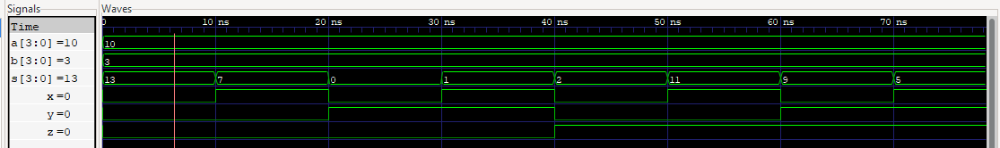

# MUX-ALU  
8x1 Multiplexer and Arithmetic Logic Unit (ALU) implemented in Verilog, with testbench and simulation.  

The project is divided into two main parts:  

1. **MUX 8x1 (4-bit)** → Selects one of eight 4-bit inputs based on 3 control signals.  
2. **ULA (ALU)** → Implements 8 arithmetic/logic operations. The result of each operation is sent to the MUX, which chooses the final output according to the control signals (`x, y, z`).  

This structure allows the ALU to reuse the multiplexer for operation selection.  

---

## MUX  
The MUX was described in Verilog with:  

- **Eight 4-bit inputs:** `f0` to `f7`  
- **Three selection inputs:** `sel0`, `sel1`, `sel2`  
- **One 4-bit output:** `op`  

The logic follows the truth table shown below:  

| x | y | z | Output (`op`) |
|---|---|---|---------------|
| 0 | 0 | 0 | f0 |
| 0 | 0 | 1 | f1 |
| 0 | 1 | 0 | f2 |
| 0 | 1 | 1 | f3 |
| 1 | 0 | 0 | f4 |
| 1 | 0 | 1 | f5 |
| 1 | 1 | 0 | f6 |
| 1 | 1 | 1 | f7 |

### Verilog description
    module mux8x1_4b (f0, f1, f2, f3, f4, f5, f6, f7, sel0, sel1, sel2, op);
    
    input [3:0] f0, f1, f2, f3, f4, f5, f6, f7;
    input sel0, sel1, sel2;
    output [3:0] op;
    
    assign op[3] = ~sel2 & ~sel1 & ~sel0 & f0[3] | ~sel2 & ~sel1 &  sel0 & f1[3] |
                   ~sel2 &  sel1 & ~sel0 & f2[3] | ~sel2 &  sel1 &  sel0 & f3[3] |
                    sel2 & ~sel1 & ~sel0 & f4[3] |  sel2 & ~sel1 &  sel0 & f5[3] |
                    sel2 &  sel1 & ~sel0 & f6[3] |  sel2 &  sel1 &  sel0 & f7[3];

    assign op[2] = ~sel2 & ~sel1 & ~sel0 & f0[2] | ~sel2 & ~sel1 &  sel0 & f1[2] |
                   ~sel2 &  sel1 & ~sel0 & f2[2] | ~sel2 &  sel1 &  sel0 & f3[2] |
                    sel2 & ~sel1 & ~sel0 & f4[2] |  sel2 & ~sel1 &  sel0 & f5[2] |
                    sel2 &  sel1 & ~sel0 & f6[2] |  sel2 &  sel1 &  sel0 & f7[2];

    assign op[1] = ~sel2 & ~sel1 & ~sel0 & f0[1] | ~sel2 & ~sel1 &  sel0 & f1[1] |
                   ~sel2 &  sel1 & ~sel0 & f2[1] | ~sel2 &  sel1 &  sel0 & f3[1] |
                    sel2 & ~sel1 & ~sel0 & f4[1] |  sel2 & ~sel1 &  sel0 & f5[1] |
                    sel2 &  sel1 & ~sel0 & f6[1] |  sel2 &  sel1 &  sel0 & f7[1];

    assign op[0] = ~sel2 & ~sel1 & ~sel0 & f0[0] | ~sel2 & ~sel1 &  sel0 & f1[0] |
                   ~sel2 &  sel1 & ~sel0 & f2[0] | ~sel2 &  sel1 &  sel0 & f3[0] |
                    sel2 & ~sel1 & ~sel0 & f4[0] |  sel2 & ~sel1 &  sel0 & f5[0] |
                    sel2 &  sel1 & ~sel0 & f6[0] |  sel2 &  sel1 &  sel0 & f7[0];
    endmodule

## RTL viewer
 

## Testbench

    `timescale 1ns/1ps

    module tb_mux8x1_4b;
    reg [3:0] f0, f1, f2, f3, f4, f5, f6, f7;
    reg sel0, sel1, sel2;
    wire [3:0] op;

    mux8x1_4b uut (
        .f0(f0), .f1(f1), .f2(f2), .f3(f3), 
        .f4(f4), .f5(f5), .f6(f6), .f7(f7),
        .sel0(sel0), .sel1(sel1), .sel2(sel2),
        .op(op)
    );

    initial begin
        $dumpfile("mux_tb.vcd");
        $dumpvars(0, tb_mux8x1_4b);

        // Estímulos
        f0 = 4'b0000; f1 = 4'b0001; f2 = 4'b0010; f3 = 4'b0011;
        f4 = 4'b0100; f5 = 4'b0101; f6 = 4'b0110; f7 = 4'b0111;

        sel2 = 0; sel1 = 0; sel0 = 0; #10;
        sel2 = 0; sel1 = 0; sel0 = 1; #10;
        sel2 = 0; sel1 = 1; sel0 = 0; #10;
        sel2 = 0; sel1 = 1; sel0 = 1; #10;
        sel2 = 1; sel1 = 0; sel0 = 0; #10;
        sel2 = 1; sel1 = 0; sel0 = 1; #10;
        sel2 = 1; sel1 = 1; sel0 = 0; #10;
        sel2 = 1; sel1 = 1; sel0 = 1; #10;

        $finish;
    end
    endmodule

## ALU
The ALU was described in Verilog with:  

- **Two 4-bit inputs:** `a`, `b`  
- **Three selection inputs:** `x`, `y`, `z`  
- **One 4-bit output:** `s`  
- **Eight internal wires (`d0–d7`)**, each corresponding to one arithmetic or logical operation.  

The wires are connected to the inputs of the multiplexer (`mux8x1_4b`), which selects the desired operation according to the selection inputs.  

| Wire | Operation |
|------|------------|
| d0   | a + b      |
| d1   | a - b      |
| d2   | a << b     |
| d3   | a >> b     |
| d4   | a & b      |
| d5   | a \| b     |
| d6   | a ^ b      |
| d7   | ~a         |

### Verilog description

    module ula (a,b,x,y,z,s);
        input [3:0] a, b;
        input x, y, z;
        output [3:0] s;
    
        wire [3:0] d0,d1,d2,d3,d4,d5,d6,d7;
    
        assign d0 = a + b;
        assign d1 = a - b;
        assign d2 = a << b;
        assign d3 = a >> b;
        assign d4 = a & b;
        assign d5 = a | b;
        assign d6 = a ^ b;
        assign d7 = ~a;
    
        mux8x1_4b muxout(
            .f0(d0), .f1(d1), .f2(d2), .f3(d3),
            .f4(d4), .f5(d5), .f6(d6), .f7(d7),
            .sel0(x), .sel1(y), .sel2(z), .op(s)
        );
    endmodule

Note: The same process of verification (testbench, simulation in GTKWave, and RTL viewer) was applied to the ALU as for the MUX, but only the MUX results are included here for brevity.

## Results
The results were verified through simulation with GTKWave.  

 

By analyzing the simulation in GTKWave, we can verify the correct behavior of the multiplexer.
For example, when the select inputs are set to sel2=0, sel1=0, sel0=1, the output is op=4, which matches the expected truth table and the Verilog description of the MUX.

 

By analyzing the ALU simulation in GTKWave, we can confirm the expected behavior.
For instance, when the select inputs are set to x=0, y=0, z=0, the output is s=13.
This result follows from the inputs a=10 and b=3, with the selected operation being addition.
The outcome is consistent with the truth table and the Verilog description of the ALU.
